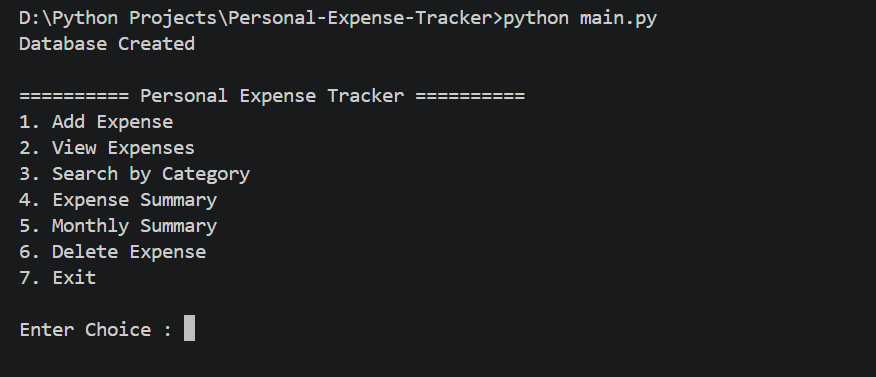
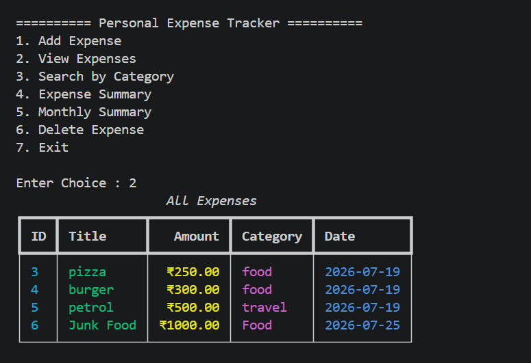
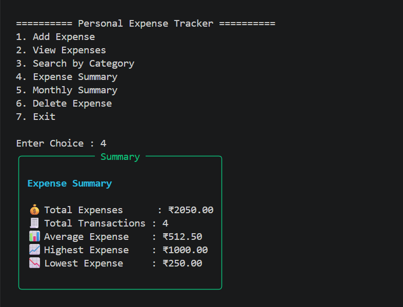
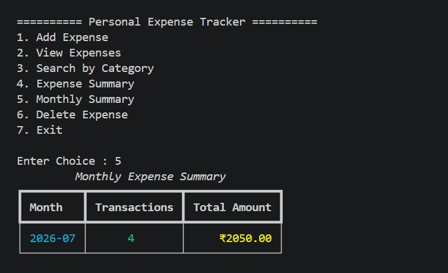

# 💰 Personal Expense Tracker

A simple and user-friendly command-line application developed using **Python** and **SQLite** to help users manage their daily expenses. This project was created as part of my **Python Development Internship** to practice file handling, database operations, and Python programming concepts.

---

## 🚀 Features

- ➕ Add New Expense
- 📋 View All Expenses
- 🔍 Search Expenses by Category
- 💰 View Expense Summary
- 📅 Monthly Expense Summary
- 🗑️ Delete Expense
- 🛡️ Input Validation
- 💾 SQLite Database Storage
- 🎨 Rich CLI Tables for Better User Experience

---

## 🛠️ Technologies Used

- Python 3
- SQLite
- Rich Library

---

## 📂 Project Structure

```
Personal-Expense-Tracker/
│
├── data/
│   └── expenses.db
│
├── models/
│   └── expense.py
│
├── services/
│   └── expense_service.py
│
├── utils/
│   └── database.py
│
├── screenshots/
│
├── main.py
├── requirements.txt
├── README.md
└── .gitignore
```

---

## ⚙️ Installation

### Clone the repository

```bash
git clone https://github.com/DivyanshSahu678/Personal-Expense-Tracker.git
```

### Navigate to project folder

```bash
cd Personal-Expense-Tracker
```

### Install dependencies

```bash
pip install -r requirements.txt
```

### Run the application

```bash
python main.py
```

---

## 📷 Project Screenshots

### Main Menu

> 

### View Expenses

> 

### Expense Summary

> 

### Monthly Summary

> 

---

## 📖 Learning Outcomes

Through this project, I gained practical experience in:

- Python Programming
- Object-Oriented Programming (OOP)
- SQLite Database Integration
- CRUD Operations
- Exception Handling
- Input Validation
- Modular Project Structure
- Git & GitHub Version Control

---

## 🔮 Future Improvements

- Edit Expense
- Search by Date
- Export Expenses to CSV
- GUI Version using Tkinter
- Expense Analytics Dashboard

---

## 👨‍💻 Author

**Divyansh Sahu**

B.Tech Computer Science Engineering

Python Developer Intern

---

⭐ If you found this project useful, consider giving it a star!